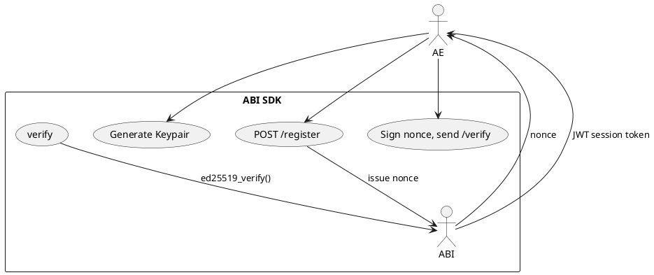
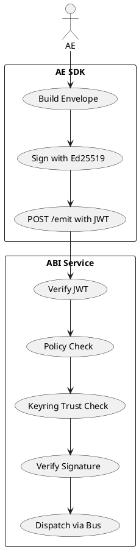

# AEGNIX ABI SDK

The **AEGNIX ABI SDK** provides the foundational components for secure swarm admission, trust governance, dynamic policy enforcement, and signed audit logging within the **AEGNIX distributed agent mesh**.

This SDK represents the **developer‑facing half** of the Agent Bridge Interface (ABI) — enabling programmatic registration, verification, capability declaration, and authenticated emission from Atomic Experts (AEs) into the secure swarm.

---

## 📦 Project Structure

```
aegnix_sdk/
├── aegnix_abi/
│   ├── __init__.py
│   ├── admission.py        # Dual‑crypto challenge/response handshake
│   ├── audit.py            # Structured, signed audit logger
│   ├── keyring.py          # Trusted keyring (SQLite-backed)
│   ├── policy.py           # Static + dynamic subject pub/sub rules
│   └── transport_pubsub.py # Audit transport adapter
├── aegnix_ae/
│   ├── client.py           # AE registration + emit client
│   └── transport/          # HTTP, Local, Pub/Sub transports
└── tests/
    ├── test_abi_sdk.py     # Phase 3F ABI tests
    └── test_ae_sdk.py      # AE SDK integration tests
```

---

## 🚀 Installation

### 1. Install **aegnix_core**

```bash
cd ../aegnix_core
pip install -e .
```

### 2. Install ABI SDK

```bash
cd ../aegnix_sdk
pip install -e .
```

### 3. Confirm installation

```bash
pip list | grep aegnix
```

Should show:

```
aegnix-core 0.3.x
aegnix-sdk  0.3.x
```

---

## 🧠 Core Concepts

| Module        | Role                                                                    |
| ------------- | ----------------------------------------------------------------------- |
| **Keyring**   | Stores AE public keys and trust states (untrusted → trusted).           |
| **Admission** | Dual‑crypto handshake: nonce challenge + Ed25519 response verification. |
| **Policy**    | Merges static YAML + dynamic capabilities for pub/sub authorization.    |
| **Audit**     | Writes structured audit envelopes (file or Pub/Sub).                    |
| **Transport** | Unified abstraction for HTTP, LocalBus, GCP Pub/Sub, NATS (future).     |

---

## 🧪 Running Full Test Suite

```bash
pytest -v -s --log-cli-level=DEBUG tests/
```

Example output:

```
============================= test session starts =============================
platform win32 -- Python 3.11.x
collected 5 items

tests/test_abi_sdk.py .....

tests/test_ae_sdk.py ..
============================== 7 passed in 0.42s =============================
```

---

## 🌙 Current Milestone: **Phase 3F (v0.3.7)**

The ABI SDK is now **fully aligned** with the ABI Service for Phase 3F:

### ✔ Completed

* Dual‑crypto admission handshake
* Trusted keyring enforcement
* Dynamic policy merge compatibility
* AE capability declaration schema
* AE client: registration → verify → JWT → emit
* Local, HTTP, Pub/Sub transports
* Full SDK test suite passing

### 🔄 Remaining for Phase 3G

* Capability‑driven dynamic policy injection
* AE role fields (for future ABI governance)
* Duplicate key protection

---

## 📡 ABI ↔ AE Registration Flow (PlantUML)



---

## 📤 Emit Flow via AE SDK (PlantUML)



---

## 🧩 Example Usage

```python
from aegnix_abi.keyring import ABIKeyring
from aegnix_abi.admission import AdmissionService

# Initialize
keyring = ABIKeyring("db/abi_state.db")
admission = AdmissionService(keyring)

# Issue challenge
nonce_b64 = admission.issue_challenge("fusion_ae")

# AE signs nonce and calls verify
ok, msg = admission.verify_response("fusion_ae", sig_b64)
print(ok, msg)
```

---

## 🗺 Roadmap

### **Phase 3G — Dynamic Policy Injection**

* AE declares capabilities → ABI merges dynamic + static policy

### **Phase 4 — Distributed Mesh**

* Full Pub/Sub federation backend
* JWT refresh tokens

### **Phase 5 — Federated ABI Clusters**

* Multi‑ABI trust domains with hierarchical governance

---

**Author:** Invictus Insights R&D
**Version:** 0.3.7 (Phase 3F Verified)
**License:** Proprietary — Patent Pending
